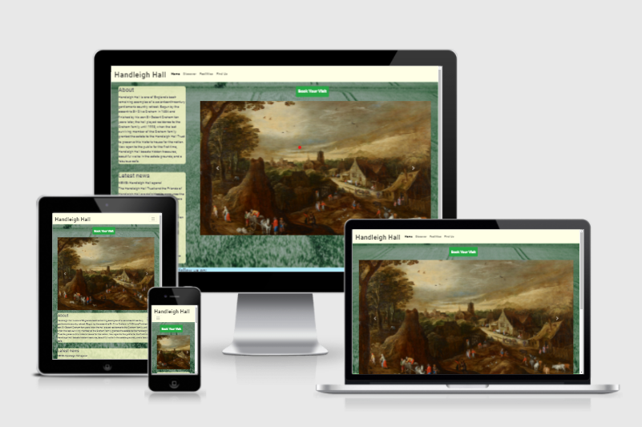
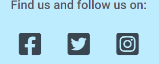

# Handleigh Hall README

https://james-vt.github.io/MS1_Handleigh_Hall/

## Table of contents

* Project overview
* UX
* User stories
* Site owner stories
* Features
* Template
* Colours
* Wireframes
* Technologies used
* Validations
* Testing
* Bugs
* Features credits

## Project overview

This project imagines the creation of a website for a fictional visitor attraction in Oxfordshire. It imagines this property - an old English country house - has recently opened to the public and the charitable trust thast runs the site wants a website for a number of purposes. They want to generate revenue by securing ticket bookings, they want to relay information to visitors about what's on offer, how to get there, and when visitors can come, and they want to generate interaction with the public. This latter will happen both directly, via a contact form, and by directing people to social media.

## UX

The main goals of the Handleigh Hall website are twofold: for its users, information; for its owners, revenue. Visitors to the site will want to know how to visit and what to expect. The owners of the site - Handleigh Hall Trust - will want to increase the revenue and publicity of the site.

## User Stories

### A user will want to:

1. Learn what Handleigh Hall is.
2. Learn when they can visit the site.
3. Learn how to get to the site.
4. Learn how to arrange a visit to the site.

## Site Owner Stories

### A site owner will want to:

5. Generate revenue through ticket sales.
6. Relay information to visitors on how to get there.
7. Generate revenue by relaying information about the food and beverage outlet on site.
8. Drive up engagement with the public via social media and direct feedback.
9. Generate donations to the charity that runs Handleigh Hall.
10. Draw in interested volunteers.

As part of the planning for this project, I have run through the stages of User Experience Design, as proposed by [Jesse James Garrett.](https://en.wikipedia.org/wiki/Jesse_James_Garrett)

Addressing the strategy plane for this project, I asked myself who would need this website, and what they might hope to achieve by using it. I have asked these questions from the point of view of the owner and a visitor to the website. The site owner wants to generate revenue and visits by selling tickets, and making visitors aware of what's available. Visitors want to know if this place is worth visiting, and how to do so.

The Scope Plane: This plane helped to prevent the project growing beyond its immediate scope. The main strategy is to generate ticket sales by promoting the property. As such, the pages in the navigation bar are chosen to address the main questions of a visitor to these places: what is it, what food and drink is available, are there public lavatories, etc.

The Structure Plane: my wireframes can be found below. These have been constructed with the idea that mobile design should come first, and that the main aim from the point of the view of the site owner is to generate income via bookings to visit the historic house. This is why the BOOK button is visible for as much of the time as possible, and each page presents its information in a way that encourages the selling of tickets.

The Skeleton Plane: The information is structured in such a way that the pictures do much of the job of catching a user's eye, with the information kept in unobtrusive places. Navigation is performed via the header, with page title links kept clear and concise. On smaller screen sizes, where the information needs to be scrolled to, the top of the first text section is visible along with its title, telling users exactly what it is they'll find there and visually informing them how to get to it. At larger screen sizes this is different, as both the images and information can be presented at once while taking away from neither. 

The Surface Plane: Colours for the website were chosen based on those colours associated with the visual look of Handleigh Hall itself. Green for the grass around it, blue for the (optimistically) blue sky above, and the beige colour of the navigation bar to resemble the colour of the local stone from which the property was constructed.

## Existing Features

* ### Header -
    * The header, built using Bootstrap (credit and link below and in source code) allows a user to navigate easily across the pages of the site. For the site owners, this is good as ease of navigation will keep a user on the sire for longer, making them more likely to book a visit.

* ### Squashed "burger" navigation menu at smaller screen sizes -
    * Another Bootstrap addition (credit and link below and in source code), this familiar three-line icon adheres to convention by giving users something familiar they know to click for a collapsed menu.

* ### Carousel -
    * The carousel found on index.html allows the site owners to present to site users a visual teaser of the attraction, and what is available there. The first picture gives them a view of the front of the building, the second of a painting inside it, and the third of a pot of tea from the catering outlet. Having these three pictures gives the site owners three chances to hook a potential visitor, and turn their visit to the site into a booking.

* ### Contact form -
    * The contact form on findus.html allows users to submit comments and queries to the site owners by filling out and submitting the three fields. This gives users a simple point of contact for acquiring further information. It also gives the site owners the chance to interact further with site visitors, giving more opportunities to turn interactions into booking/ticket sales.

* ### Booking button -
    * The booking button found on every page except bookingform.html itself allows users to navigate to the booking form at any time once they have decided they've seen enough to interest them. This helps to secure bookings and generate revenue for the site owners. 

* ### Booking form -
    * The first page of a booking form has been built in to the bookingform.html page. This allows users to arrange to visit the site. It also allows the site owners to sell tickets online.

* ### Text boxes -
    * The boxes of text on each page allow users to learn the information they need. They also allow to site owners to provide a mix of text and images to communicate what Handleigh Hall is and answer the most commonly-sought bits of information by a visitor.

* ### Footer -
    * Conforming to convention, the footer contains some of the most basic information - social media links, the charity number, how a visitor can contribute and the contact details. These last in particular are important for the user to have another means of contacting Handleigh Hall Trust other than the contact form, and also for knowing where Handleigh Hall is. Presenting the information here also allows the site owners to answer some very commonly-asked questions - namely, the address, phone number and email address - automatically.

User story number achieved by this feature | Goal  | How was this achieved? | User or site owner goal? | Evidence
----- | ---------------------- | ------------------- | -------- | -----
3 | Learn how to get to the site. | Getting here instructions and details in footer | User | [Getting here](assets/images/gettinghere.png)
6 | Relay information to visitors on how to get there. | Find Us page instructions | Site owner| [Getting here](assets/images/gettinghere.png)  
---  
  
* ## Social media links in the footer -
    * These allow a user to quickly move to other sites where they can learn more about Handleigh Hall and interact with the organisation. For the site owners, this increased interaction is another chance to turn interaction into ticket sales.

User story number achieved by this feature | Goal  | How was this achieved? | Success or failure? | Evidence
----- | ---------------------- | ------------------- | -------- | -----
8 | Drive up engagement with the public via social media | Social media links in footer of every page | Success | [Social media links](assets/images/readmeevidence/socialcontact.png)
---

## Features left to implement

* ### Booking form payment page -
    * The booking form currently has no payment options as I have not yet learned how to do this. This would not change the form as it currently exists. Once the user has completed the first page of the booking form, they would click the "proceed to payment" button and be taken to a new form to finish the transaction.

## Template

Aspiring to simplicity, the website has been designed with a simple template that can be used across all pages. The background images have been chosen carefully (credit for these can be found below) to provide a visual indication of what's on offer at the property, and space has been left so that these remain visible on all screen sizes.

### Colours

Beige: #ffffe6
Oxford Blue: #0A122A
Steel Blue: #4F7CAC
Dark Liver: #55555f
Platinum: ##e5e7e6

Colour matching site used: [coolers.]https://coolors.co/ffffe6-0a122a-4f7cac-950952-023618

For the site's colours, I have chosen colours of beige and blue. The beige is to match the colour of Cotswold stone from which the fictional building is constructed, and Oxford Blue matches this well according to the colour matcher I used. Following on from these two colours, the next match was Steel Blue, which I have used to colour the Font Awesome icons. A similar beige colour to the header was chosen for the text boxes as these will scroll up over the background images or sit alongside them at wider screen sizes.

For the font, Dark Liver was used for the right level of contrast. Black would've been too harsh against the biege. Platinum was a colour I found on the website of the Imperial War Museum, and I found it worked much better than white as a background colour next to the biege.

### Wireframes

The layout of the pages for this project were planned using Balsamiq's wireframes. The wireframes for mobile devices can be found [here.](docs/wireframes/wireframems1mobile.pdf) The wireframes for tablets can be found [here.](docs/wireframes/wireframems1tablet.pdf) The wireframes for desktops can be found [here.](docs/wireframes/wireframems1desktop.pdf)

## Technologies Used

* [Balsamiq](https://balsamiq.com/)
    * Balsamiq was used to develop the wireframes for this project.

* [HTML5](https://html5.org) 
    * The HTML pages for this site were written using HTML5. TODO: CHECK IF THIS SITE IS CORRECT

* [CSS3](http://www.css3.info/)
    * The CSS styling for this site was written using CSS3. TODO: CHECK IF THIS SITE IS CORRECT

* [Bootstrap](https://getbootstrap.com/)
    * Bootstrap was used in this project to provide styling frameworks and for the automatic elements of responsive design it comes with. The version I have used is Bootstrap 4.

* [Crop Circle](https://crop-circle.imageonline.co/#circlecropresult)
    * Crop Circle, a feature of imageonline.co, was used to create the circular images on the Discover page.

* [Cooler](https://coolors.co/ffffe6-0a122a-4f7cac-e5e7e6-023618)
    * Cooler was used as a colour-matcher for the site. Once I'd decided to use biege, I was able to enter this colour into Cooler's colour-picker feature and choose from colours that matched well with it.

* [Google Maps](https://www.google.com/search?q=google+maps&oq=google+maps&aqs=chrome..69i57j0i433l2j0i131i433l2j69i60l3.2408j0j7&sourceid=chrome&ie=UTF-8)
    * This is used for the map on the findus.html page.

## Validations
* HTML + CSS validations, no errors, links to evidence pictures
* Accessibility - wave
* Performance - lighthouse

## Testing
Testing against stories - how was this goal achieved? Evidence - screenshot

### Testing against user goals

Below I have tested the sites functions and features against the user goals.

Number | Goal  | How was this achieved? | Success or failure? | Evidence
----- | ---------------------- | ------------------- | -------- | -----
1 | Learn what Handleigh Hall is. | Information on home page | Success | [About section](assets/images/indexabout.png)
2 | Learn when they can visit the site. | Opening times section | Success | [Opening times ](assets/images/openingtimes.png)
3 | Learn how to get to the site. | Getting here instructions | Success | [Getting here](assets/images/gettinghere.png)
4 | Learn how to arrange a visit to the site. | Booking page | Success | [Booking form](assets/images/bookingform.png)

### Testing against site owner goals

Below I have tested the site's functions and features against the site owner goals.

Number | Goal  | How was this achieved? | Success or failure? | Evidence
----- | ---------------------- | ------------------- | -------- | -----
5 | Generate revenue through ticket sales. | Booking button prevelant on every page | Success | [Book Your Visit button](assets/images/bookingbutton.png)
6 | Relay information to visitors on how to get there. | Find Us page instructions | Success | [Getting here](assets/images/gettinghere.png)
7 | Generate revenue by relaying information about the food and beverage outlet on site. | Facilities page | Success | [Eating and drinking](assets/images/catering.png)
8 | Drive up engagement with the public via social media | Every page | Success | [Social media links](assets/images/socialcontact.png)

## Bugs

* An issue was discovered on very large screen widths with the footer bunching up to the left if the text boxes don't have enough content in them. I suspect this is something to do with the blank space I left for the background image, but I'm uncertain why it only happens at screen widths approaching 1800 pixels. As yet, this is unfixed as the amount of content I have on each page is enough to keep everything where it should be even at these larger widths and in the hypothetical situation in which this was a genuine website for a genuine property, the amount of information in those text sections would become more over time, not less.

# Credits

## Navigation bar
* The original code for the site's navigation bar in the header is taken from Bootstrap 4's [Nav code.](https://getbootstrap.com/docs/4.0/components/navbar/#nav) I have edited it with some styling.

## Footer stlying
* The footer styling was taken from a footer rtemplate, found [here](https://codepen.io/mdbootstrap/full/YEPERj)

## Footer spacing
* The column spacing in the footer was acheived using Bootstrap 4's [Grid system.](https://getbootstrap.com/docs/4.0/layout/grid/#auto-layout-columns)

## List Unstyled
* The .list-unstyled class is a Bootstrap 4 class used for [list styling.](https://getbootstrap.com/docs/4.6/components/list-group/)

## Font
* The font used throughout is Roboto, a google fonts font, and sans-serif is used as the backup for if Roboto cannot load. [Roboto.](https://fonts.google.com/specimen/Roboto#standard-styles)

## Index/home page
* Background image is an open-source image. [Photo by Yaosheng Zheng on Unsplash](https://unsplash.com/photos/mpGz-JBOnZU)

* First carousel image is of Lodge Park, taken from Wikipedia. [Link and licence.](https://commons.wikimedia.org/wiki/File:Lodge_Park,_Gloucestershire,_May_2016_side_view.jpg)

* Second carousel image is open-source, photo taken by Birmingham Museums Trust. [Photo by Birmingham Museums Trust on Unsplash](https://unsplash.com/photos/P2pGX2-zWNs)

* Third carousel image is open-source, photo taken from unsplash. [Photo by Content Pixie on Unsplash](https://unsplash.com/photos/m-gqDRzbJLQ)

## Find Us page
* The directions and text used on the Find Us page were taken from the website for [Lodge Park and the Sherborne Park Estate](https://www.nationaltrust.org.uk/lodge-park-and-sherborne-park-estate#How%20to%20get%20here) and edited to suit.

* The contact form on the Find Us page was adapted from Bootstrap 4's contact page template, found [here.](https://getbootstrap.com/docs/4.0/components/forms/#form-controls)

* Background image on the Find Us page is an open-source image. [Photo by Randy Fath on Unsplash.](https://unsplash.com/photos/TUXrJZCNHbU)

## Discover page
* Back ground image on the Discover page is an open-source image. [Photo by Annie Spratt on Unsplash.](https://unsplash.com/photos/GWCvnsMtiBg)

## Facilities page
* Background image on the Facilities page is an open-source image. [Photo by Suhyeon Choi on Unsplash.](https://unsplash.com/photos/4Ia348kvX7A)

## Carousel
* Carousel used is one of Bootstrap's components, found [here.](https://getbootstrap.com/docs/4.0/components/carousel/#with-controls)

## Booking modal
* The modal used as a landing page for a booking feature is borrowed in part from two places: [Bootstrap](https://getbootstrap.com/docs/4.0/components/modal/) and, for some minor styling/positioning of the close button, [W3C](https://www.w3schools.com/css/css_positioning.asp). I also found [this](https://stackoverflow.com/questions/34627271/understanding-how-data-dismiss-attribute-works-in-bootstrap) from Stackoverflow to be useful in determining how to actually program said button to close the modal.

* The booking form on the Booking page was adapted from Bootstrap 4's contact page template, found [here.](https://getbootstrap.com/docs/4.0/components/forms/#form-controls)

# Image credits
* earlstrafford.jpg is a portrait of Thomas Wentworth, Earl of Strafford, which I took from wikipedia [here](https://en.wikipedia.org/wiki/Earl_of_Strafford)

* bluebells.jpg is a picture taken near Lampeter in Wales by Marion Phillips, CC BY-SA 2.0, borrowed by me from Wikipedia [here](https://commons.wikimedia.org/w/index.php?curid=13376247)

* parliament.jpg is a print made in the 17th century, credit By 17th-century print - http://history.wisc.edu/sommerville/123/123%20305.htm, Public Domain, https://commons.wikimedia.org/w/index.php?curid=4240530, borrowed by me from Wikipedia [here](https://en.wikipedia.org/wiki/English_Civil_War#/media/File:LongParliament.jpg)

* kingcharles.jpg by Anthony van Dyck, posted by Follower of Anthony van Dyck - she-philosopher.com(original upload)Sothebys 2012 (higher resolution upload), Public Domain, https://commons.wikimedia.org/w/index.php?curid=3852590 to [here](https://en.wikipedia.org/wiki/English_Civil_War#/media/File:King_Charles_I_after_original_by_van_Dyck.jpg)

* afamilygroup.jpg is the painting A Family Group by Anthony Van Dyck, in tbhe public domain. Original held by the Detroit Institute of Arts. Attribution: Anthony van Dyck, Public domain, via Wikimedia Commons. Found [here](https://commons.wikimedia.org/wiki/File:Anton_Van_Dyck_A_Family_Group.JPG).

## Facilities gallery
 * honeycakes.jpg is taken from Wikimedia Commons, found [here](https://commons.wikimedia.org/wiki/File:Dulcia_Piperata_(Peppered_Honey_Cake),_Apicius,_De_Re_Coquinaria_7,11,4_(23218879433).jpg) by Carole Raddato from FRANKFURT, Germany, CC BY-SA 2.0 <https://creativecommons.org/licenses/by-sa/2.0>, via Wikimedia Commons.

 * tea.jpg is taken from Wikimedia Commons, found [here](https://commons.wikimedia.org/wiki/File:%E0%A6%B2%E0%A7%87%E0%A6%AC%E0%A7%81_%E0%A6%9A%E0%A6%BE_(Lemon_tea).jpg) by Dolon Prova, CC BY-SA 4.0 <https://creativecommons.org/licenses/by-sa/4.0>, via Wikimedia Commons.

 * teasplash.jpg is taken from Wikimedia Commons, found [here](https://commons.wikimedia.org/wiki/File:Tea_in_action.jpg) by Tesla Delacroix, CC BY-SA 4.0 <https://creativecommons.org/licenses/by-sa/4.0>, via Wikimedia Commons.

 * chocolate.jpg is taken from Wikimedia Commons, found [here](https://commons.wikimedia.org/wiki/File:Chocolate_espeso.jpg) by LWY from Pasadena, USA, CC BY 2.0 <https://creativecommons.org/licenses/by/2.0>, via Wikimedia Commons.

 * icecreamcup.jpg is taken from Wikimedia Commons, here [here](https://commons.wikimedia.org/wiki/File:Ice_cream_cup.jpg) by Killarnee, CC BY-SA 4.0 <https://creativecommons.org/licenses/by-sa/4.0>, via Wikimedia Commons.