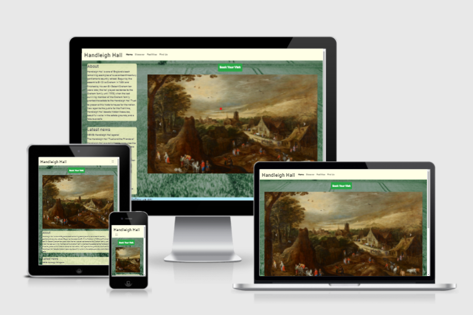

# Handleigh Hall

## [View live site](https://james-vt.github.io/MS1_Handleigh_Hall/)

## Table of contents

1. [Project overview](https://github.com/James-VT/MS1_Handleigh_Hall#project-overview)
2. [UX](https://github.com/James-VT/MS1_Handleigh_Hall#ux)
3. [User stories](https://github.com/James-VT/MS1_Handleigh_Hall#user-stories)
    * [First time user stories](https://github.com/James-VT/MS1_Handleigh_Hall#a-first-time-user-will-want-to)
    * [Returning user stories](https://github.com/James-VT/MS1_Handleigh_Hall#a-returning-user-will-want-to)
    * [Site owner stories](https://github.com/James-VT/MS1_Handleigh_Hall#a-site-owner-will-want-to)
4. [The Five Planes of User Experience Development](https://github.com/James-VT/MS1_Handleigh_Hall#the-five-planes-of-user-experience-development)
5. [Features](https://github.com/James-VT/MS1_Handleigh_Hall#features)
6. [Design choices](https://github.com/James-VT/MS1_Handleigh_Hall#design-choices)
    * [Colours](https://github.com/James-VT/MS1_Handleigh_Hall#colours)
    * [Imagery](https://github.com/James-VT/MS1_Handleigh_Hall#imagery)
    * [Font](https://github.com/James-VT/MS1_Handleigh_Hall#font)
    * [Wireframes](https://github.com/James-VT/MS1_Handleigh_Hall#wireframes)
7. [Technologies used](https://github.com/James-VT/MS1_Handleigh_Hall#technologies-used)
8. [Deployment](https://github.com/James-VT/MS1_Handleigh_Hall#deployment)
9. [Testing](https://github.com/James-VT/MS1_Handleigh_Hall#testing)
10. [Credits](https://github.com/James-VT/MS1_Handleigh_Hall#credits)
11. [Image credits](https://github.com/James-VT/MS1_Handleigh_Hall#image-credits)

# Project overview

This project imagines the creation of a website for a fictional visitor attraction in Oxfordshire. It imagines this property - an old English country house - has recently opened to the public and the charitable trust that runs the site wants a website for a number of purposes. They want to generate revenue by securing ticket bookings, they want to relay information to visitors about what's on offer, how to get there, and when visitors can come, and they want to generate interaction with the public. This latter will happen both directly, via a contact form, and by directing people to social media.

---

# UX

The main goals of the Handleigh Hall website are twofold: for its users, information; for its owners, revenue. Visitors to the site will want to know how to visit and what to expect. The owners of the site - Handleigh Hall Trust - will want to increase the revenue and publicity of the site.

## User Stories

### A first time user will want to:

1. Learn what Handleigh Hall is.
2. Navigate easily through the site to find information.
3. Learn when they can visit the site.
4. Learn how to get to the site.
5. Learn how to arrange a visit to the site.

### A returning user will want to:

6. Give feedback after a visit to the property.
7. Learn about how they can contribute to the site financially.
8. Learn about how to inquire about volunteering opportunities at the site.
9. Read new blog and news entries to learn what has changed at the property.

### A site owner will want to:

10. Generate revenue through ticket sales.
11. Relay information to visitors on how to get there.
12. Generate revenue by relaying information about the food and beverage outlet on site.
13. Drive up engagement with the public via social media and direct feedback.
14. Generate donations to the charity that runs Handleigh Hall.
15. Draw in interested volunteers.
16. Receive feedback/queries/complaints from returning users/visitors to the property

---

## The Five Planes of User Experience Development

As part of the planning for this project, I have run through the stages of User Experience Design, as proposed by [Jesse James Garrett.](https://en.wikipedia.org/wiki/Jesse_James_Garrett)

### The Strategy plane

Addressing the strategy plane for this project, I asked myself who would need this website, and what they might hope to achieve by using it. I have asked these questions from the point of view of the owner and a visitor to the website. The site owner wants to generate revenue and visits by selling tickets, and making visitors aware of what's available. Visitors want to know if this place is worth visiting, and how to do so.

### The Scope Plane

This plane helped to prevent the project growing beyond its immediate scope. The main strategy is to generate ticket sales by promoting the property. As such, the pages in the navigation bar are chosen to address the main questions of a visitor to these places: what is it, what food and drink is available, are there public lavatories, etc.

### The Structure Plane 

My wireframes can be found below. These have been constructed with the idea that mobile design should come first, and that the main aim from the point of the view of the site owner is to generate income via bookings to visit the historic house. This is why the BOOK button is visible for as much of the time as possible, and each page presents its information in a way that encourages the selling of tickets.

### The Skeleton Plane
The information is structured in such a way that the pictures do much of the job of catching a user's eye, with the information kept in unobtrusive places. Navigation is performed via the header, with page title links kept clear and concise. On smaller screen sizes, where the information needs to be scrolled to, the top of the first text section is visible along with its title, telling users exactly what it is they'll find there and visually informing them how to get to it. At larger screen sizes this is different, as both the images and information can be presented at once while taking away from neither. 

### The Surface Plane
Colours for the website were chosen based on those colours associated with the visual look of Handleigh Hall itself. Green for the grass around it, blue for the (optimistically) blue sky above, and the beige colour of the navigation bar to resemble the colour of the local stone from which the property was constructed.

---

# Features

Below I have listed the features with which the website will launch. I have provided screenshots of these, and have elaborated on which user stories they satisfy.

* ## Header -
    * The header, built using Bootstrap (credit and link below and in source code) allows a user to navigate easily across the pages of the site. For the site owners, this is good as ease of navigation will keep a user on the sire for longer, making them more likely to book a visit.

    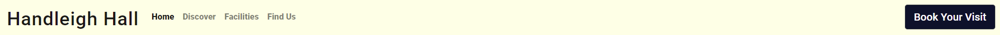

    User story number achieved by this feature | User story goal | How was this achieved? | User or site owner goal? |
    ----- | ------------ | ------------------- | -------- |
    2 | Navigate easily through the site to find information | The title of each page, and the booking button, are there at the top. These are recognisable to a user as navigation links, and make their content clear. | First time user
    5 | Learn how to arrange a visit to the site | The wording of "book your visit" in the booking button, clearly visible in the header bar at all screen sizes, is unambiguous. Its colouring makes it stand out from the background, highlighting its importance and the fact it will functio differently to a normal page link. | First time user
    10 | Generate revenue through ticket sales | The "book your visit" button is clearly visible to users, and is always present in the header bar at all screen sizes - it does not meld with the burger menu on small devices. Therefore, the ask for a booking/sale is always being made when a user lands on a page. | Site owner
    11 | Relay information to visitors on how to get there | The Find Us page link, due to its title, could be reasonably expected by a user to hold information on how to reach the property. | Site owner
    12 | Generate revenue by relaying information about the food and beverage outlet on site | The Facilities page link, due to its title, could be reasonably expected to hold information regarding the catering offer at the property. | Site owner

---

* ## Squashed "burger" navigation menu at smaller screen sizes -
    * Another Bootstrap addition (credit and link below and in source code), this familiar three-line icon adheres to convention by giving users something familiar they know to click for a collapsed menu.
    
    

    User story number achieved by this feature | User story goal | How was this achieved? | User or site owner goal? |
    ----- | ------------ | ------------------- | -------- |
    2 | Navigate easily through the site to find information | Famailiar burger menu is used across the internet for devices of all sizes, but mostly mobile devices. This is the most recognisable icon that could be used to tell people "click here for a navigation menu." | First time user

---

* ## Carousel -
    * The carousel found on index.html allows the site owners to present to site users a visual teaser of the attraction, and what is available there. The first picture gives them a view of the front of the building, the second of a painting inside it, and the third of a pot of tea from the catering outlet. Having these three pictures gives the site owners three chances to hook a potential visitor, and turn their visit to the site into a booking.
    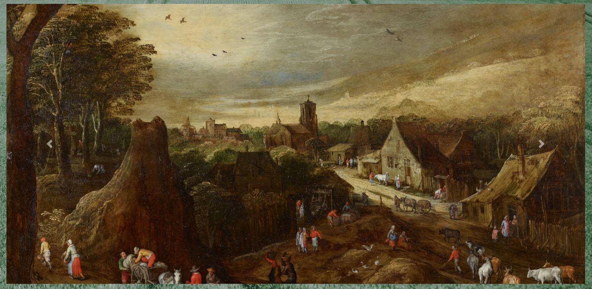

    User story number achieved by this feature | User story goal | How was this achieved? | User or site owner goal? |
    ----- | ------------ | ------------------- | -------- |
    10 | Generate revenue through ticket sales | Enticing images in the carousel are designed to attract visitors to make bookings | Site owner

---

* ## Contact form -
    * The contact form on findus.html allows users to submit comments and queries to the site owners by filling out and submitting the three fields. This gives users a simple point of contact for acquiring further information. It also gives the site owners the chance to interact further with site visitors, giving more opportunities to turn interactions into booking/ticket sales.
    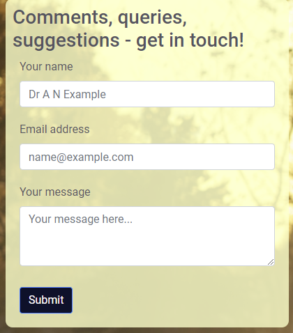

    User story number achieved by this feature | User story goal | How was this achieved? | User or site owner goal? |
    ----- | ------------ | ------------------- | -------- |
    6 | Give feedback after a visit to the property | The contact form is the method by which a user can give feedback | Returning user
    16 | Receive feedback/queries/complaints from returning users/visitors to the property | The contact form allows the site owners to receive feedback and other communication from users | Site owner
    
    ---

* ## Booking button -
    * The booking button found on every page allows users to navigate to the booking form at any time once they have decided they've seen enough to interest them. This helps to secure bookings and generate revenue for the site owners.

    

User story number achieved by this feature | User story goal | How was this achieved? | User or site owner goal? |
----- | ------------ | ------------------- | -------- |
5 | Learn how to arrange a visit to the site. | The button to book a visit is apparent on every page, and unambiguously worded. | First time user
10 | Generate revenue through ticket sales | Users can book tickets from any part of the site | Site owner

---

* ## Booking form -
    * The first page of a booking form has been built into a modal accessible from every page. This allows users to arrange to visit the site. It also allows the site owners to sell tickets online.

    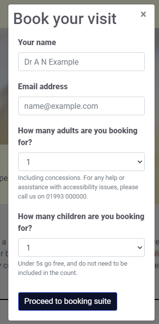

User story number achieved by this feature | User story goal | How was this achieved? | User or site owner goal? |
----- | ------------ | ------------------- | -------- |
5 | Learn how to arrange a visit to the site. | Booking form modal allows users to book their visit | First time user
10 | Generate revenue through ticket sales. | Booking form modal allows users to begin process of buying and paying for tickets | Site owner

---

* ## Text boxes -
    * The boxes of text on each page allow users to learn the information they need. They also allow to site owners to provide a mix of text and images to communicate what Handleigh Hall is and answer the most commonly-sought bits of information by a visitor. The picture below is merely that of an example text-box. As it can relay any information put into it, it can tick off a greater number of user/site owner goals than just this one but I use it as an example here.

    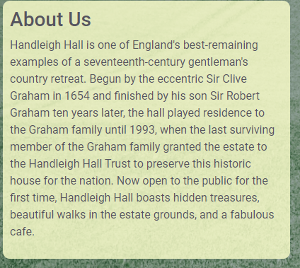
    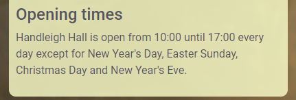
    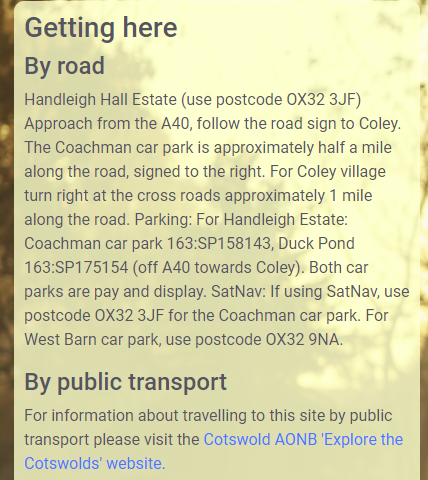
    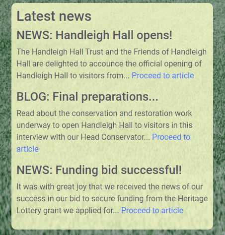

User story number achieved by this feature | User story goal | How was this achieved? | User or site owner goal?
----- | ---------------------- | ------------------- | -------- |  
1 | Learn what Handleigh Hall is. | Information on home page About Us section | First time user |  
3 | Learn when they can visit the site. | Opening times section has opening times | First time user | 
9 | Read new blog and news entries to learn what has changed at the property | Latest News section has links to blog articles | Return user
11 | Relay information to visitors on how to get there | Getting here section has directions | Site owner

---

* ## Footer -
    * Conforming to convention, the footer contains some of the most basic information - social media links, the charity number, how a visitor can contribute and the contact details. These last in particular are important for the user to have another means of contacting Handleigh Hall Trust other than the contact form, and also for knowing where Handleigh Hall is. Presenting the information here also allows the site owners to answer some very commonly-asked questions - namely, the address, phone number and email address - automatically.

    

--- 

User story number achieved by this feature | User story goal | How was this achieved? | User or site owner goal? |
----- | ---------------------- | ------------------- | -------- |
4 | Learn how to get to the site. | Address and postcode details in footer | First time/returning user
7 | Learn about how they can contribute to the site financially. | Instructions to contact the site directly in order to donate are in the footer | Returning user
8 | Learn about how to inquire about volunteering opportunities at the site | Instructions to inquire directly about volunteering opportunities located in footer | Returning user

---  
  
* ## Social media links in the footer -
    * These allow a user to quickly move to other sites where they can learn more about Handleigh Hall and interact with the organisation. For the site owners, this increased interaction is another chance to turn interaction into ticket sales.

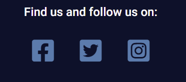

User story number achieved by this feature | User story goal | How was this achieved? | Success or failure? 
----- | ---------------------- | ------------------- | -------- 
8 | Drive up engagement with the public via social media | Social media links in footer of every page | Success 

---

## Features left to implement

* ### Booking form payment page -
    * The booking form currently has no payment options as I have not yet learned how to do this. This would not change the form as it currently exists. Once the user has completed the first page of the booking form, they would click the "proceed to booking suite" button and be taken to a new form to finish the transaction.

---

# Design choices

Why did I make the choices I made? 

## Colours

* Beige: #ffffe6
* Oxford Blue: #0A122A
* Steel Blue: #4F7CAC
* Platinum: ##e5e7e6
* Dark Liver: #55555f

Colour matching site used: [coolers.](https://coolors.co/ffffe6-0a122a-4f7cac-950952-023618)

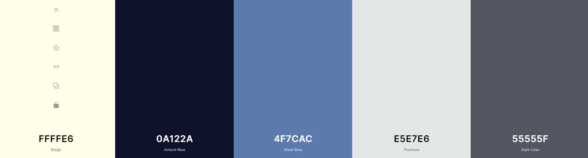

For the site's colours, I have chosen colours of beige, blue and grey. The beige is to match the colour of Cotswold stone from which the fictional building is constructed, a picture of which is first on the home page carousel. Oxford Blue pairs well with this according to the colour matcher I used, Coolers (link above). Following on from these two colours, the next match was Steel Blue, which I have used to colour the Font Awesome icons. A similar beige colour to the header was chosen for the text boxes as these will scroll up over the background images or sit alongside them at wider screen sizes.

For the font, Dark Liver was used for the right level of contrast. Black would've been too harsh against the biege. Platinum was a colour I found on the website of the Imperial War Museum, and I found it worked much better than white as a background colour next to the biege of the banner.

## Imagery

The pictures for the site are intended to give visitors a teaser of the property. We have an outside image of the "house," a painting and a picture of a teapot on the home page's carousel. These three images can be taken to tease three of the main parts of the offer. The house itself, its contents and history, and food and drink. 

Pictures are used strategically on the other pages as well. The Discover page has a small gallery of images appropriate to the era, the personalities and the landscape. Furthermore, the sections further down the page are each accompanied by an appropriate image.

On the facilities page we have a small upside-down pyramid of five images to showcase the catering offer at Handleigh Hall's tea pavillion. When it comes to food and drink, images can so often speak louder than words. My inspiration for this minimalist approach came from the Imperial War Museum's web page about its cafe at its London museum, link below.

https://www.iwm.org.uk/visits/iwm-london/eat-drink

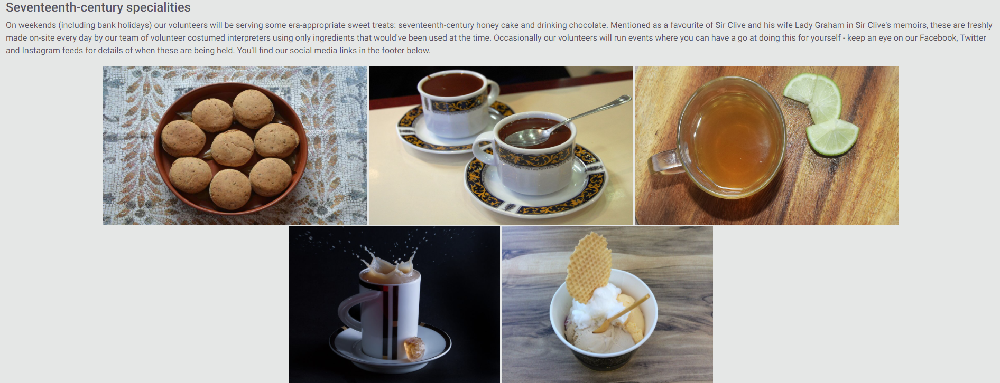

The find us page is also kept simple re: images, so as not to distract from the important information and embedded Google map on that page. Its only image is the background image of a man driving a pony and trap, in a hat that is (or at least, very much resembles) an era-appropriate one.

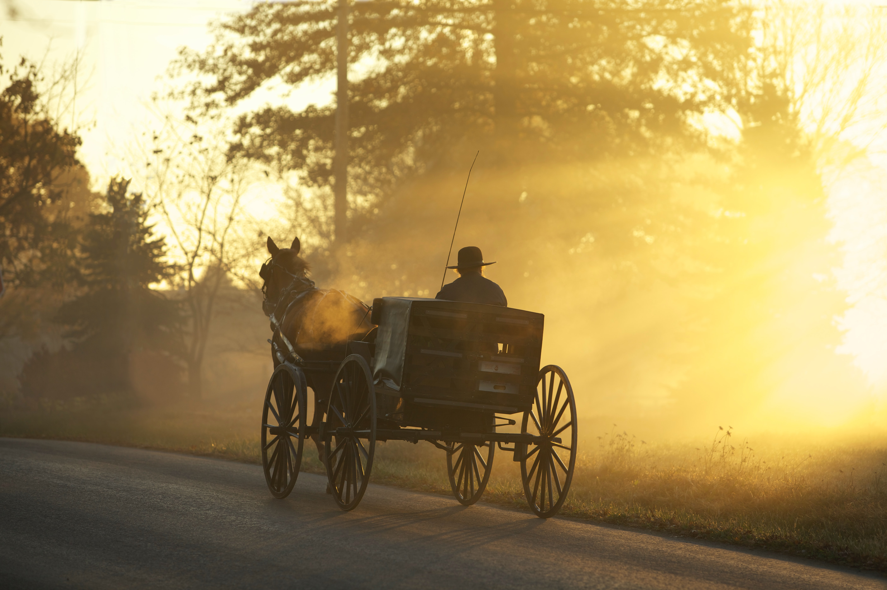

## Font

[Roboto.](https://fonts.google.com/specimen/Roboto#standard-styles)

The font used throughout this project is Roboto, a google font linked in the credits and the CSS sheet. I considered a sort of calligraphy-esque font to look like a handwritten letter of the time, but this would create unnecessary difficultly for reading comprehension in many people, not just those with visual impairments. As such, I decided to stick with the popular Roboto font which is used on a lot of websites nowadays. Reinventing the wheel just for the sake of being flash can be fun, but isn't sensible in areas relating to accessibility. Sans-serif is there as a back-up.

## Wireframes

The layout of the pages for this project were planned using Balsamiq's wireframes. The wireframes for mobile devices can be found [here.](docs/wireframes/wireframems1mobile.pdf) The wireframes for tablets can be found [here.](docs/wireframes/wireframems1tablet.pdf) The wireframes for desktops can be found [here.](docs/wireframes/wireframems1desktop.pdf)

---

## Technologies Used

* [Balsamiq](https://balsamiq.com/)
    * Balsamiq was used to develop the wireframes for this project.

* [HTML5](https://html5.org) 
    * The HTML pages for this site were written using HTML5.

* [CSS3](http://www.css3.info/)
    * The CSS styling for this site was written using CSS3.

* [Bootstrap](https://getbootstrap.com/)
    * Bootstrap was used in this project to provide styling frameworks and for the automatic elements of responsive design it comes with. The version I have used is Bootstrap 4.

* [Crop Circle](https://crop-circle.imageonline.co/#circlecropresult)
    * Crop Circle, a feature of imageonline.co, was used to create the circular images on the Discover page.

* [Cooler](https://coolors.co/ffffe6-0a122a-4f7cac-e5e7e6-023618)
    * Cooler was used as a colour-matcher for the site. Once I'd decided to use biege, I was able to enter this colour into Cooler's colour-picker feature and choose from colours that matched well with it.

* [Google Maps](https://www.google.com/search?q=google+maps&oq=google+maps&aqs=chrome..69i57j0i433l2j0i131i433l2j69i60l3.2408j0j7&sourceid=chrome&ie=UTF-8)
    * This is used for the map on the findus.html page.

* [Autoprefixer CSS online](https://autoprefixer.github.io/)
    * Autoprefixer was used to run my CSS through and get any various vendor prefixes (so, webkit prefixes) that I needed to make my pages consistent across browsers.

* [Google Chrome](https://www.google.co.uk/chrome/?brand=FKPE&gclid=EAIaIQobChMIyMfvy8bH8AIVqRkGAB2XywuMEAAYASAAEgIpkvD_BwE&gclsrc=aw.ds)
    * This project was completed using Google Chrome as a browser for development and all testing, excluding the testing done on other browsers to be sure of compatibility across multiple browsers.

* [Opera](https://www.opera.com/)
    * The site was tested in Opera for responsiveness and general compatibility with this browser.

* [Microsoft Edge](https://www.microsoft.com/en-us/edge)
    * The site was tested in Microsoft Edge for resonsiveness and general compatibility with this browser.

* [WAVE](https://wave.webaim.org/)
    * WAVE was used to test the accessibility of the site for individuals with disabilities.

* [Am I Responsive?](http://ami.responsivedesign.is/?url=https://backpocket.co)
    * Am I Responsive? is used to check whether a site is responsive across screen sizes.

* [Lighthouse](https://developers.google.com/web/tools/lighthouse)
    * Lighthouse is used to check the performance, accessibility and best practice ratings of a web page.

* [W3's Nu HTML Checker](https://validator.w3.org/nu/)
    * W3's Checker can test for errors and flag sctructure warnings for HTML and CSS. I have it to test for both.

* [Jigsaw](https://jigsaw.w3.org/css-validator/)
    * Jigsaw is a service run by W3C for checking CSS specifically.

* [Git](https://git-scm.com/)
    * Git was used for version control. I wrote this entire project in the GitPod extenstion for Google Chrome, and the repository is held on GitHub.

---

# Deployment
 Here I'll explain how to deploy/how I deployed the website to GitHub and how to run it locally. 

### Deploying a static project to GitHub pages:
 1. You'll need a GitHub account, if you don't already have one. Head to their site https://github.com and you'll see the sign-up links straightaway on the home page. Google Chrome is the recommended browser for GitHub.
 2. Once you're signed-up, this'll be your landing page.
 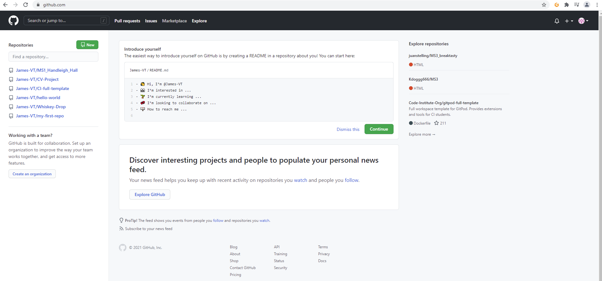
 3. Click on the user icon in the top right corner of the screen - in the example above, mine is the little pink and white checkered circle. Click "settings" in this list.
 4. On the next screen, you'll see a menu on the left. Click "repositories" in this menu.
 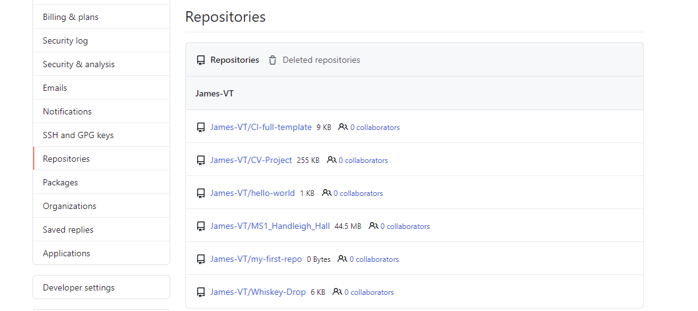
 5. You'll come to the screen above. Click the repository you want - in this case, Handleigh Hall.
 6. Then, from the bar along the top (not the nav bar - lower, under the repo name) click Settings.
 7. On the Settings page, click "Pages" from the left-hand menu.
 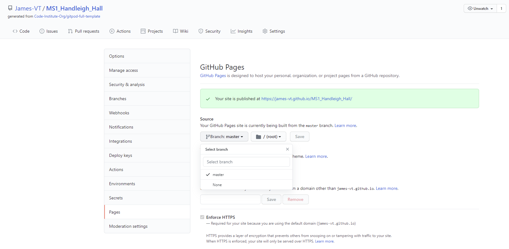
 8. In the picture I've attached, you can see I've opened a drop down menu which, before you've deployed, will have a default value of none. Click this, then set it to Main or Master depending on the version you're using. Mine, having been already deployed, says Master and yours will too when deployed, but ignore that discrepancy for now.
 9. Click Save.
 10. The page will refresh, and you'll see it change to say "Your site is ready to be deployed at "https://username.github.io/repository-name/"
 11. Be aware this deployed site will take a few minutes to deploy, usually about ten. Be patient and don't click while it's building as that can slow it down.
 12. Click the link to make sure it works after a suitable wait. Et voila, you've deployed the site!

### Forking the repository for your own use
This creates a copy of the repository for editing or viewing without affecting my (original) version. If you want to do it, do this:
1. You'll need a GitHub account. Go to https://github.com to make one.
2. Locate the repository (this one). At the top right of the page, beneath my pink and white avatar, you'll see the Fork button. Click it.
3. This should add a version for you to use in your own repository. Have fun with it!

### Cloning the repository
Another way of getting your own local version to work on is to clone the repository. Below are the steps.
1. You'll need a GitHub account. Go to https://github.com to make one.
2. Locate the repository (this one).
3. Click Code, the button just to the left of the green GitPod button.
4. Click HTTPS to make sure you're in it, then copy the link you see there.
6. Head into GitPod or your IDE of choice, and open up the terminal.
5. Switch your working directory to the location you want to the cloned directory created.
6. Then you want to type "git clone https://github.com/James-VT/MS1_Handleigh_Hall", the same URL as before.
7. Hit Enter. You're good to go!

---

# Testing
## [I have written my testing documentation in a separate document, found here.](https://github.com/James-VT/MS1_Handleigh_Hall/blob/master/testing.md)

---

# Credits

## Navigation bar
* The original code for the site's navigation bar in the header is taken from Bootstrap 4's [Nav code.](https://getbootstrap.com/docs/4.0/components/navbar/#nav) I have edited it with some styling.

## Footer styling
* The footer styling was taken from a footer rtemplate, found [here](https://codepen.io/mdbootstrap/full/YEPERj)

## Webkit/vendor/browser prefixes
* The vendor prefixes in my CSS come from [Autoprefixer CSS online](https://autoprefixer.github.io/)

## Footer spacing
* The column spacing in the footer was acheived using Bootstrap 4's [Grid system.](https://getbootstrap.com/docs/4.0/layout/grid/#auto-layout-columns)

## List Unstyled
* The .list-unstyled class is a Bootstrap 4 class used for [list styling.](https://getbootstrap.com/docs/4.6/components/list-group/)

## Font
* The font used throughout is Roboto, a google fonts font, and sans-serif is used as the backup for if Roboto cannot load. [Roboto.](https://fonts.google.com/specimen/Roboto#standard-styles)

## Find Us page
* The directions and text used on the Find Us page were taken from the website for [Lodge Park and the Sherborne Park Estate](https://www.nationaltrust.org.uk/lodge-park-and-sherborne-park-estate#How%20to%20get%20here) and edited to suit.

* The contact form on the Find Us page was adapted from Bootstrap 4's contact page template, found [here.](https://getbootstrap.com/docs/4.0/components/forms/#form-controls)

## Carousel
* Carousel used is one of Bootstrap's components, found [here.](https://getbootstrap.com/docs/4.0/components/carousel/#with-controls)

## Booking modal
* The modal used as a landing page for a booking feature is borrowed in part from two places: [Bootstrap](https://getbootstrap.com/docs/4.0/components/modal/) and, for some minor styling/positioning of the close button, [W3C](https://www.w3schools.com/css/css_positioning.asp). I also found [this](https://stackoverflow.com/questions/34627271/understanding-how-data-dismiss-attribute-works-in-bootstrap) from Stackoverflow to be useful in determining how to actually program said button to close the modal.

* The booking form on the Booking page was adapted from Bootstrap 4's contact page template, found [here.](https://getbootstrap.com/docs/4.0/components/forms/#form-controls)

## Buttons
* The site's buttons are taken from Bootstrap, [here](https://getbootstrap.com/docs/4.6/components/buttons/).

## Icons
* Social media icons are taken from [Font Awesome](https://fontawesome.com/).

# Image credits

## Discover images
* earlstrafford.jpg is a portrait of Thomas Wentworth, Earl of Strafford, which I took from wikipedia [here](https://en.wikipedia.org/wiki/Earl_of_Strafford), attribution: Anthony van Dyck, Public domain, via Wikimedia Commons

* bluebells.jpg is a picture taken near Lampeter in Wales by Marion Phillips, CC BY-SA 2.0, borrowed by me from Wikipedia [here](https://commons.wikimedia.org/w/index.php?curid=13376247)

* parliament.jpg is a print made in the 17th century, credit By 17th-century print - http://history.wisc.edu/sommerville/123/123%20305.htm, Public Domain, https://commons.wikimedia.org/w/index.php?curid=4240530, borrowed by me from Wikipedia [here](https://en.wikipedia.org/wiki/English_Civil_War#/media/File:LongParliament.jpg)

* kingcharles.jpg by Anthony van Dyck, posted by Follower of Anthony van Dyck - she-philosopher.com(original upload)Sothebys 2012 (higher resolution upload), Public Domain, https://commons.wikimedia.org/w/index.php?curid=3852590 to [here](https://en.wikipedia.org/wiki/English_Civil_War#/media/File:King_Charles_I_after_original_by_van_Dyck.jpg)

* afamilygroup.jpg is the painting A Family Group by Anthony Van Dyck, in tbhe public domain. Original held by the Detroit Institute of Arts. Attribution: Anthony van Dyck, Public domain, via Wikimedia Commons. Found [here](https://commons.wikimedia.org/wiki/File:Anton_Van_Dyck_A_Family_Group.JPG).

* Banner image on the Discover page is an open-source image. [Photo by Annie Spratt on Unsplash.](https://unsplash.com/photos/GWCvnsMtiBg)

## Index carousel

* The landing image of "Handleigh Hall" is actually taken from Lodge Park, and is taken from the Wikipedia article for that property. It is open-source https://en.wikipedia.org/wiki/Lodge_Park_and_Sherborne_Estate#/media/File:Lodge_Park,_Gloucestershire,_May_2016_side_view.jpg, attribution: Celuici, CC BY-SA 4.0 <https://creativecommons.org/licenses/by-sa/4.0>, via Wikimedia Commons.

* The second image is from a portrait by Jan Breughel the Younger. Photo by https://unsplash.com/@birminghammuseumstrust?utm_source=unsplash&utm_medium=referral&utm_content=creditCopyText Birmingham Museums Trust on https://unsplash.com/@birminghammuseumstrust?utm_source=unsplash&utm_medium=referral&utm_content=creditCopyText.

* The final image is from Photo by Content Pixie on Unsplash, URL https://unsplash.com/photos/m-gqDRzbJLQ

## Facilities gallery
 * honeycakes.jpg is taken from Wikimedia Commons, found [here](https://commons.wikimedia.org/wiki/File:Dulcia_Piperata_(Peppered_Honey_Cake),_Apicius,_De_Re_Coquinaria_7,11,4_(23218879433).jpg) by Carole Raddato from FRANKFURT, Germany, CC BY-SA 2.0 <https://creativecommons.org/licenses/by-sa/2.0>, via Wikimedia Commons.

 * tea.jpg is taken from Wikimedia Commons, found [here](https://commons.wikimedia.org/wiki/File:%E0%A6%B2%E0%A7%87%E0%A6%AC%E0%A7%81_%E0%A6%9A%E0%A6%BE_(Lemon_tea).jpg) by Dolon Prova, CC BY-SA 4.0 <https://creativecommons.org/licenses/by-sa/4.0>, via Wikimedia Commons.

 * teasplash.jpg is taken from Wikimedia Commons, found [here](https://commons.wikimedia.org/wiki/File:Tea_in_action.jpg) by Tesla Delacroix, CC BY-SA 4.0 <https://creativecommons.org/licenses/by-sa/4.0>, via Wikimedia Commons.

 * chocolate.jpg is taken from Wikimedia Commons, found [here](https://commons.wikimedia.org/wiki/File:Chocolate_espeso.jpg) by LWY from Pasadena, USA, CC BY 2.0 <https://creativecommons.org/licenses/by/2.0>, via Wikimedia Commons.

 * icecreamcup.jpg is taken from Wikimedia Commons, here [here](https://commons.wikimedia.org/wiki/File:Ice_cream_cup.jpg) by Killarnee, CC BY-SA 4.0 <https://creativecommons.org/licenses/by-sa/4.0>, via Wikimedia Commons.

 * Banner image on the Facilities page is an open-source image. [Photo by Suhyeon Choi on Unsplash.](https://unsplash.com/photos/4Ia348kvX7A)

## Find Us background image
 * Background image on the Find Us page is an open-source image. [Photo by Randy Fath on Unsplash.](https://unsplash.com/photos/TUXrJZCNHbU)