# WAVE testing
https://wave.webaim.org/
* WAVE stands for Web Accessibility Evaluation Tool. It makes sure your website is useable by people who may have impaired vision or other difficulties.
* To use it, go to the website above and paste the deployed URL of your webpage into the "web page address input. What you'll get is what you see below.

### WAVE test for index.html
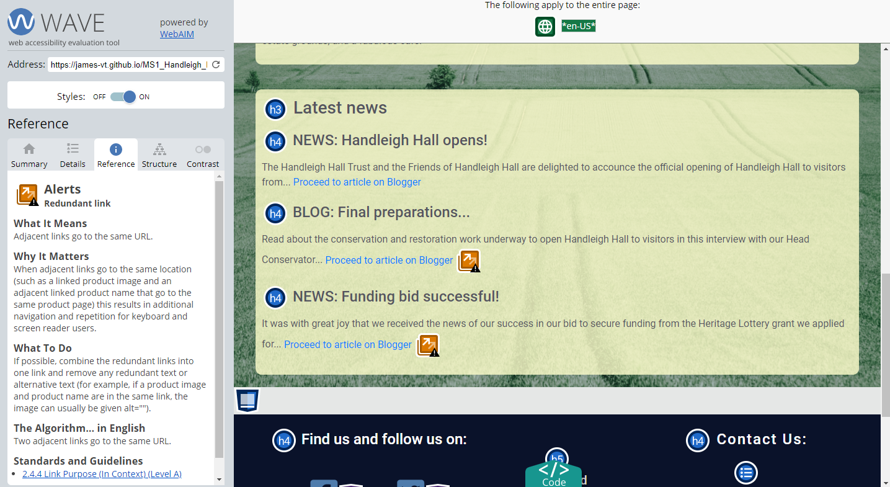

### WAVE test for discover.html
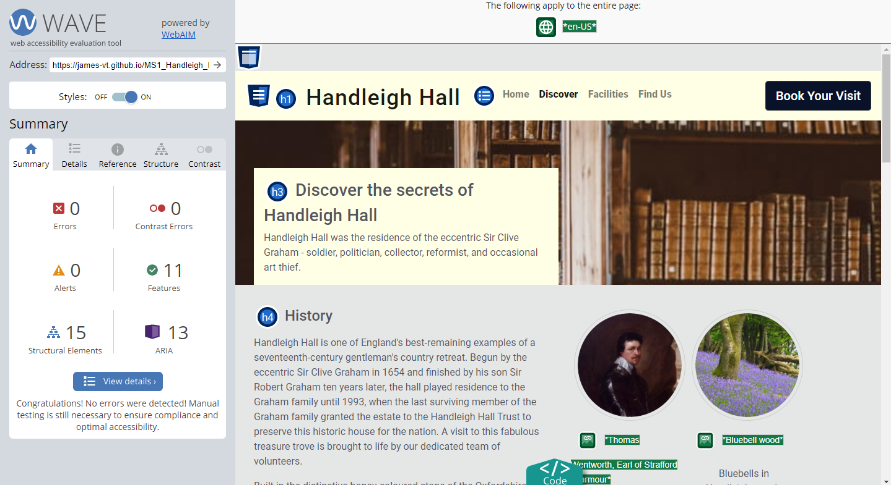

### WAVE test for facilities.html
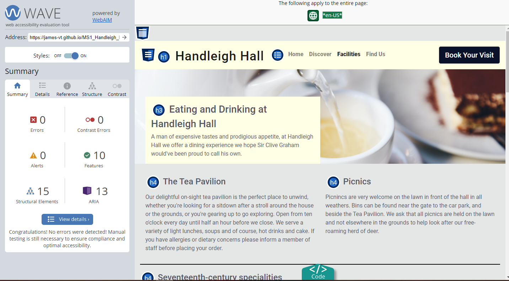

### WAVE test for findus.html

# Lighthouse testing
https://developers.google.com/web/tools/lighthouse
* Lighthouse is a validator built into Google Chrome, used for testing the performance, accessibility, best practice and more of a web page. Specifically I have used it to make sure all my pages are above the 80% mark in performance.
* To use Lighthouse, you can download Google Chrome web browser and use it from there or use one of the alternative options in the link above. Personally, I used Chrome. Right click on any web page, choose the bottom "inspect" option and click it. Then, in the dev tools that open up, the top bar will have a symbol of two little arrows. Select this, and you'll see Lighthouse at the bottom. Open it up from there, and click generate report. Voila.

### Lighthouse test for index.html
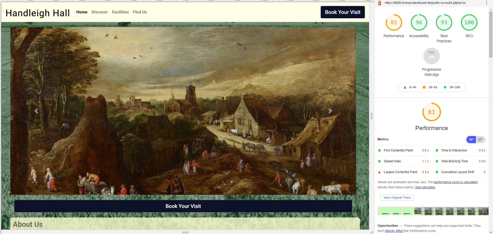

### Lighthouse test for discover.html

### Lighthouse test for facilities.html
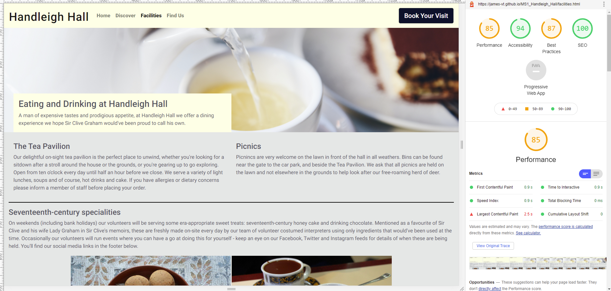

### Lighthouse test for findus.html
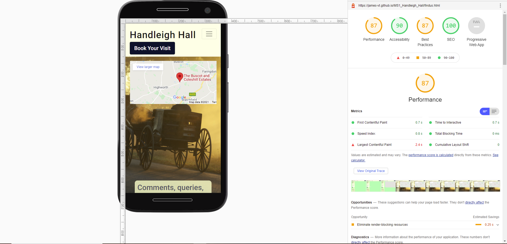

The Lighthouse test result for findus.html was revealing in that it helps show just how much of an impact Google maps can have on a site. Ideally we'd sit at 90+ on every score, but having stripped out some content already from what was planned, this was the best we could manage with embedded Google maps.

For the findus.html page I have included the screenshot below of Lighthouse's best practise section to illustrate once again just how much Google maps can hammer a page's score. You can see the "same site cookie" issue that is raised nearly a dozen times. The scores are still acceptable, but frustrating as they could've been higher.

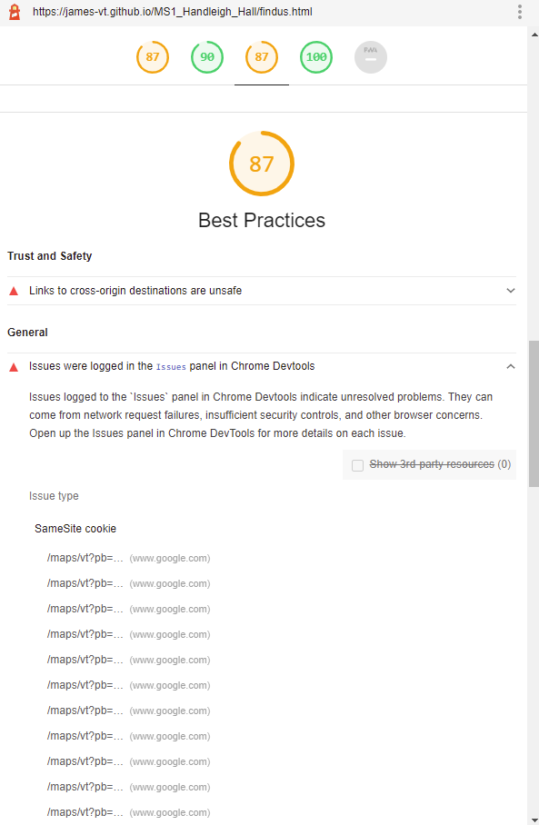

# W3 testing
https://validator.w3.org/nu/
* The W3 validator checks HTML for errors or bad practices. I have run each page through it to check to see if the code is good. Results below.
* To use the Nu HTML checker, just go to the above site, punch in the URL of the page you want to check, and Bob's your uncle.

### W3 test for index.html
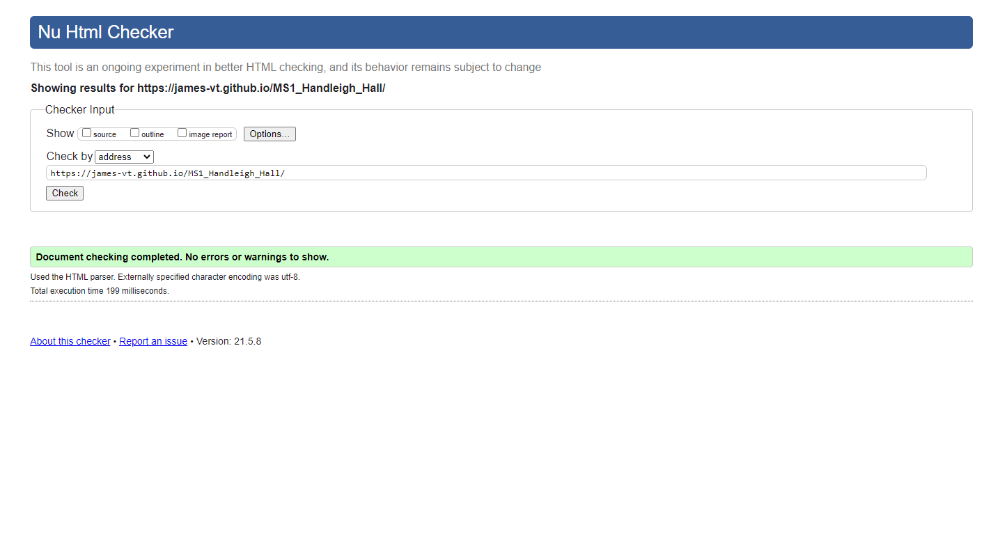

### W3 test for discover.html

### W3 test for facilities.html
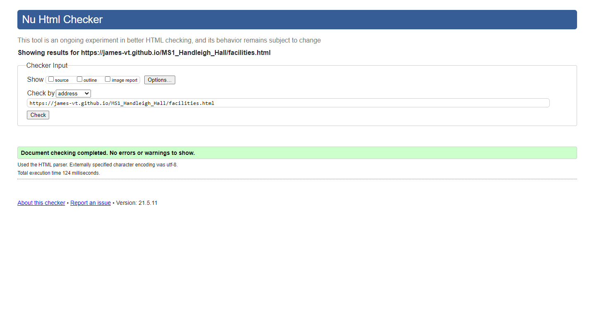

### W3 test for findus.html
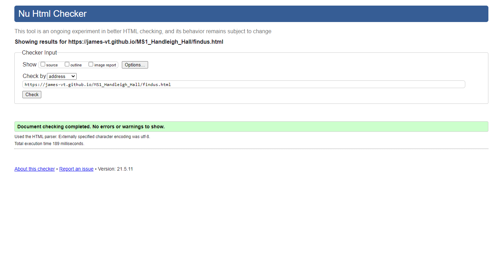

### W3 test for style.css
* W3's great because it can give you feedback for your CSS as well. Just click that CSS toggle next to the "Check by" input and paste it in.
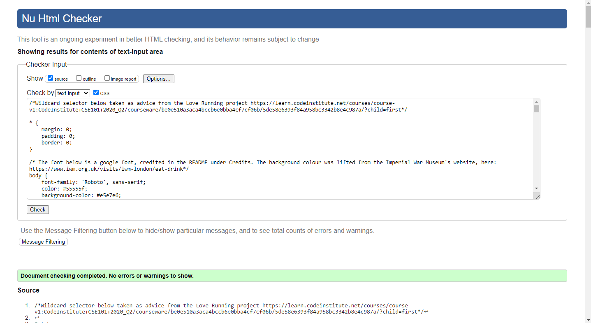

# Browser testing

## Google Chrome
The entire Handleigh Hall project was created in Chrome, and Chrome is what I have used for the testing throughout. All the pictures you see, apart from the ones in this section clearly marked as being from another browser, are taken in Chrome so it has been extensively tested for compatibility with Chrome.

---

## Opera
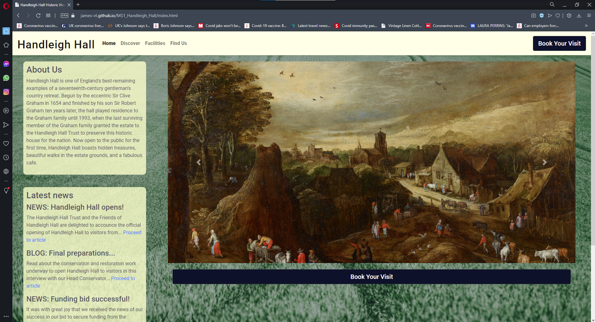

The homepage maintains its layout at all widths - above, you can see it at full screen width for a desktop.

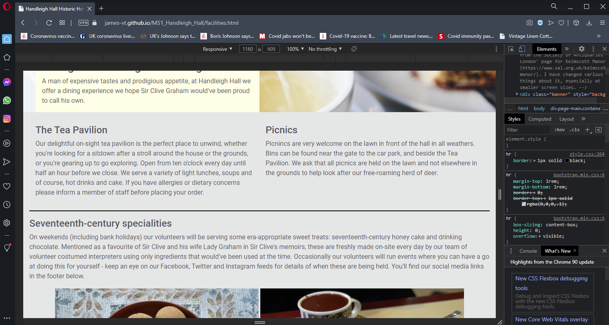

To test responsiveness, I checked each page at different screen widths. This allowed me to test the links as well, all of which are working as expected in Opera. Above, you can see the facilities page in mid width.

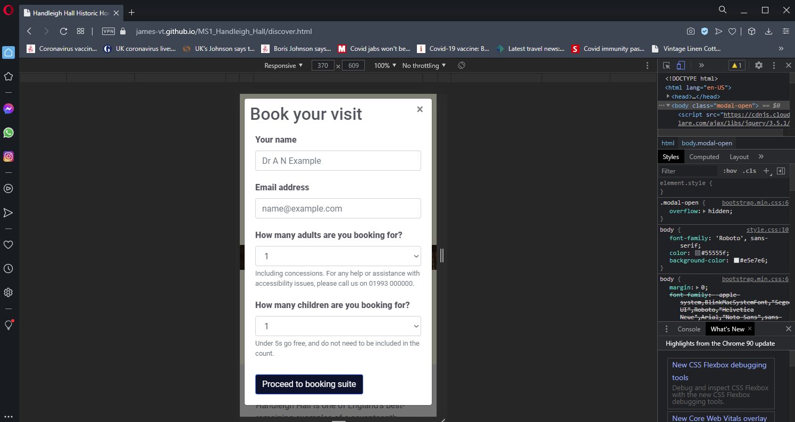

Here's the discover page in small width in Opera, with the modal open, which is opening on every page.

---

## Microsoft Edge
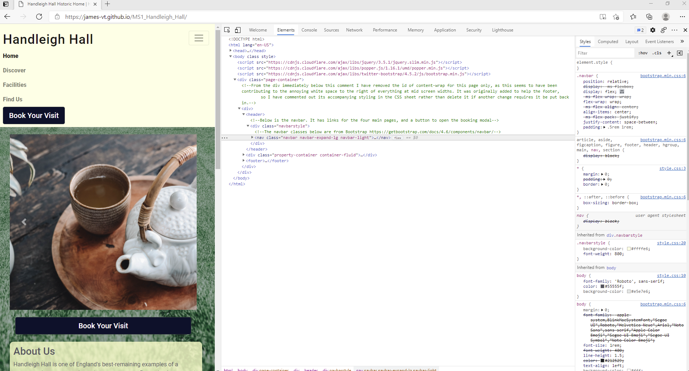
Above, I tested the home page in a small device width in Edge to be sure of its responsiveness. I have confirmed that this is consistent across all pages in Edge.

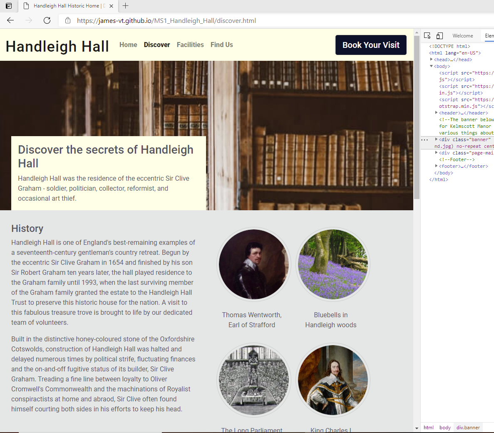
The image above is of one of the pages I tested for responsives at the mid-size screen width in Edge. These worked fine. In this example, you can see how the navigation menu opens at this width.

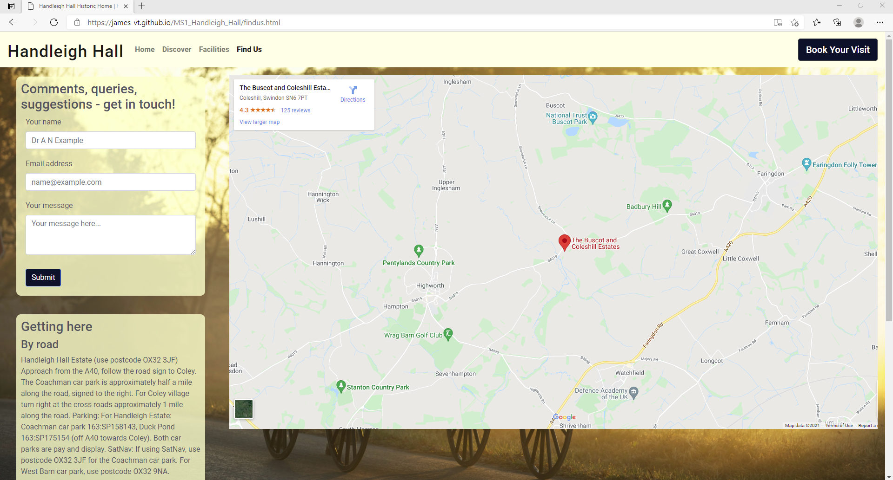
And here you can see an example of one of the pages at full width in Edge - in this case, the Find Us page with the embedded Google Map at its full extent.

Testing against stories - how was this goal achieved? Evidence - screenshot

# Testing the site against the goals of a user and of a site owner - NOT YET UPDATED WITH NEW FILEPATHS

### Testing against user goals

Below I have tested the site's functions and features against the first time user goals.

User story number | A first time user will want to:  | How was this achieved? | Success or failure? | Evidence
----- | ---------------------- | ------------------- | -------- | -----
1 | Learn what Handleigh Hall is. | Information on home page - specifically, the About Us section | Success | [About Us section](docs/evidence/testingevidence/userstoryevidence/indexabout.png)
2 | Navigate easily through the site to find information. | Header | Success | [Header](docs/evidence/readmeevidence/featureevidence/header.png)
3 | Learn when they can visit the site. | Opening times section | Success | [Opening times](docs/evidence/testingevidence/userstoryevidence/openingtimes.png)
4 | Learn how to get to the site. | Getting here instructions | Success | [Getting here](docs/evidence/testingevidence/userstoryevidence/gettinghere.png)
5 | Learn how to arrange a visit to the site. | Booking page | Success | [Booking form](docs/evidence/testingevidence/userstoryevidence/bookingform.png)

Below I have tested the site's functions and features against the returning user goals.

Number | A returning user will want to: | How was this achieved? | Success or failure? | Evidence
----- | ---------------------- | ------------------- | -------- | -----
6 | Give feedback after a visit to the property | Feedback form | Success | [Feedback/contact form](docs/evidence/readmeevidence/featureevidence/contactform.png)
7 | Learn about how they can contribute to the site financially | footer | success | [Footer text](docs/evidence/readmeevidence/featureevidence/footer.png)
8 | Learn about how to inquire about volunteering opportunities at the site | footer | success | [Footer text](docs/evidence/readmeevidence/featureevidence/footer.png)
9 | Read new blog and news entries to learn what has changed at the property | latest news section | success | [Latest news](docs/evidence/readmeevidence/featureevidence/blogtextbox.png)

### Testing against site owner goals

Below I have tested the site's functions and features against the site owner goals.

Number | Goal  | How was this achieved? | Success or failure? | Evidence
----- | ---------------------- | ------------------- | -------- | -----
10 | Generate revenue through ticket sales. | Booking button prevelant on every page | Success | [Book Your Visit button](assets/images/bookingbutton.png)
11 | Relay information to visitors on how to get there. | Find Us page instructions | Success | [Getting here](assets/images/gettinghere.png)
12 | Generate revenue by relaying information about the food and beverage outlet on site. | Facilities page | Success | [Eating and drinking](assets/images/catering.png)
13 | Drive up engagement with the public via social media | Every page | Success | [Social media links](assets/images/socialcontact.png)
14 | Generate donations to the charity that runs Handleigh Hall | footer | success | [Footer text](docs/evidence/readmeevidence/featureevidence/footer.png)
15 | Draw in interested volunteers. | footer | success | [Footer text](docs/evidence/readmeevidence/featureevidence/footer.png)
16 | Receive feedback/queries/complaints from returning users/visitors to the property | contact form | success | [Feedback/contact form](docs/evidence/readmeevidence/featureevidence/contactform.png)

# Bugs

### Map overhang
This was a very annoying bug that meant at certain screen widths, you couldn't fill in or see the top part of the contact form as the emedded Google map was overflowing onto it.

* What did I try?

I tried using various display options such as block, inline and inline-block to get some idea of what the problem might relate to. Failing that, I had a play around with the dev tools and this still cast very little light on the problem. Unfortunately Google's own embedded class makes Google Maps a pain to work with - I'd already had to borrow code in order to get the infernal thing to be responsive - so I had to add yet another media query to a project which is one-third media queries already. Tedious, but it did the job. Media queries are a powerful tool.

* What fixed the bug?

A media query.

    /* The below code makes Google maps not overflow onto the feedback form */
    @media screen and (max-width: 1225px) and (min-width: 950px) {
        .map-container {
            overflow: hidden;
            height: 400px;
        }
    }
    
---

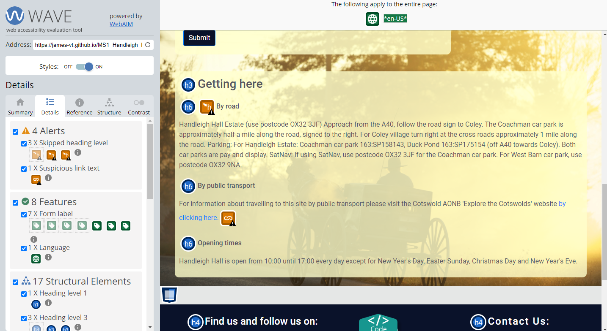
### Non-sequential heading elements
Not necesarily a bug as such, but a problem that needed to be solved nonetheless. It turns out that playing fast and loose with heading elements was causing a problem for screen readers. As such, heading elements on the findus.html page were made sequential - thus, an h1 element can only be followed by an h2, and an h2 by an h3, et cetera.

* What fixed the bug?

Sequential heading elements.

    <h1>
    <h2>
    <h3> is okay.

    <h5>
    <h2>
    <h1> is not okay.
---

### Unresponsive nav bar menu

In testing, it emerged that the burger menu in nav bar on facilities.html at small screen sizes wasn't opening. It was fine on other pages.

* What did I try?

To investigate, I tried comparing the code with the pages on which it did work and found that, in order to improve the performance of the page, I'd commented out a script that was loaded automatically with CodeInstitute's template. Having un-commented it, it is now working again.

    
    
    <!---->
* What fixed the bug?

^You can see that that last script is commented out. Simple remove the <!--> from either end and it's good to go again.