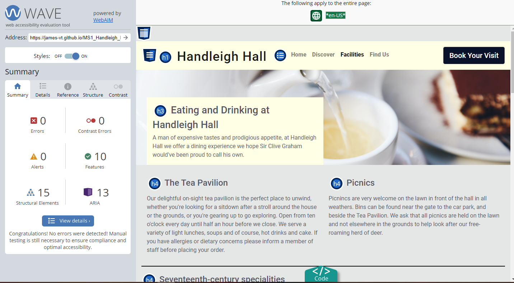
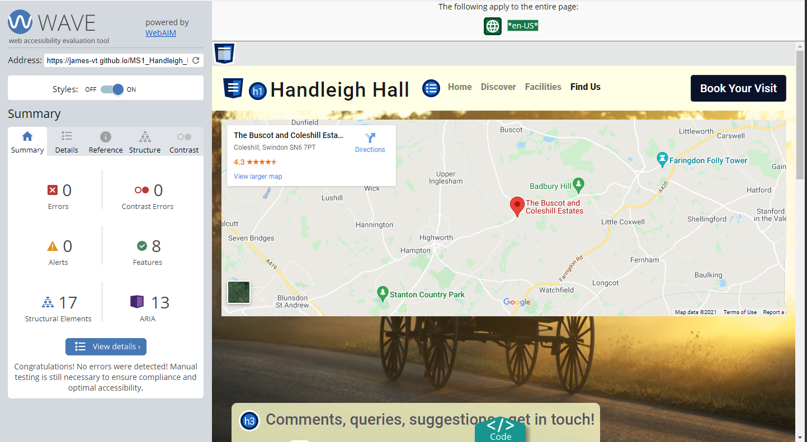

# WAVE testing

* WAVE stands for Web Accessibility Evaluation Tool. It makes sure your website is useable by people who may have impaired vision or other difficulties.

WAVE test for index.html

WAVE test for discover.html

WAVE test for facilities.html

WAVE test for findus.html

# Lighthouse testing

The Lighthouse test result for findus.html was revealing in that it helps show just how much of an impact Google maps can have on a site. Ideally we'd sit at 90+ on every score, but having stripped out some content already from what was planned, this was the best we could manage with embedded Google maps.

For the findus.html page I have included the screenshot below of Lighthouse's best practise section to illustrate once again just how much Google maps can hammer a page's score. You can see the "same site cookie" issue that is raised nearly a dozen times. The scores are still acceptable, but frustrating as they could've been higher.

# Bugs

This was a very annoying bug that meant at certain screen widths, you couldn't fill in or see the top part of the contact form as the emedded Google map was overflowing onto it.

* What did I try?

I tried using various display options such as block, inline and inline-block to get some idea of what the problem might relate to. Failing that, I had a play around with the dev tools and this still cast very little light on the problem. Unfortunately Google's own embedded class makes Google Maps a pain to work with - I'd already had to borrow code in order to get the infernal thing to be responsive - so I had to add yet another media query to a project which is one-third media queries already. Tedious, but it did the job. Media queries are a powerful tool.

* What fixed the bug?

A media query.

    /* The below code makes Google maps not overflow onto the feedback form */
    @media screen and (max-width: 1225px) and (min-width: 950px) {
        .map-container {
            overflow: hidden;
            height: 400px;
        }
    }
    

Not necesarily a bug as such, but a problem that needed to be solved nonetheless. It turns out that playing fast and loose with heading elements was causing a problem for screen readers. As such, heading elements on the findus.html page were made sequential - thus, an h1 element can only be followed by an h2, and an h2 by an h3, et cetera.

* What fixed the bug?

Sequential heading elements.

    <h1>
    <h2>
    <h3> is okay.

    <h5>
    <h2>
    <h1> is not okay.