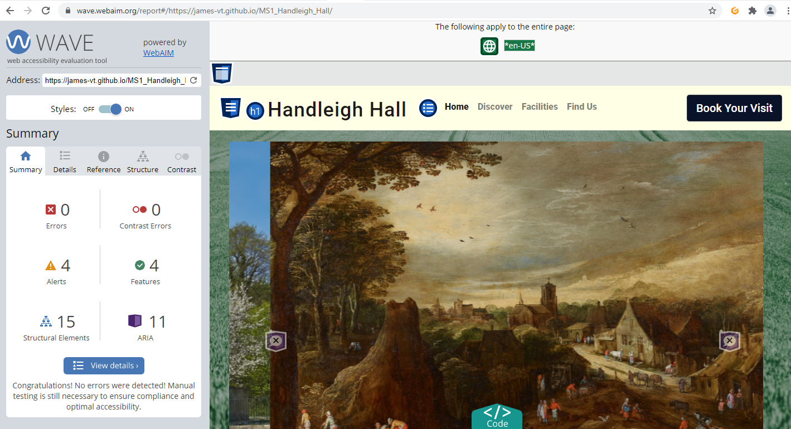
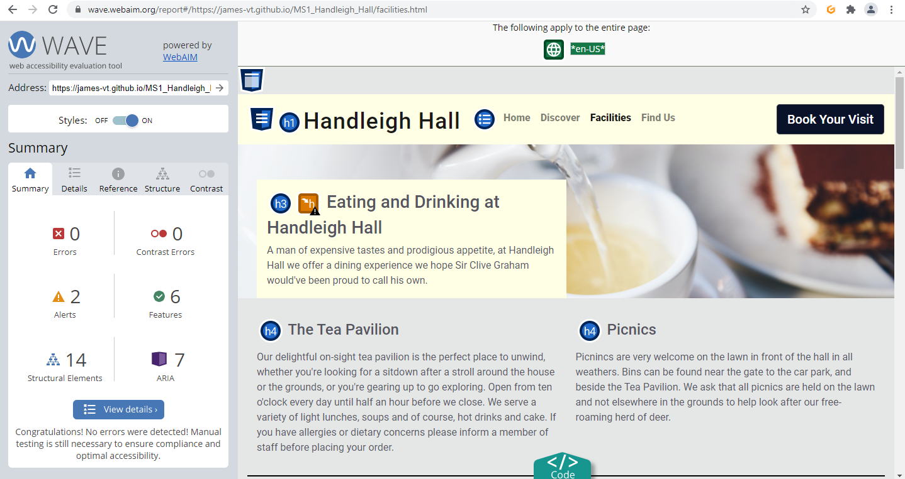
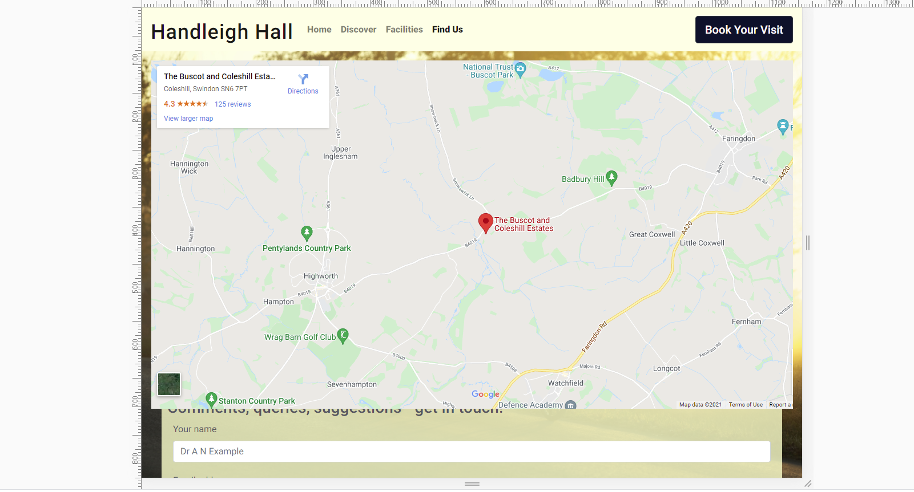

# WAVE testing

* Wave tests for accessibility.

# Bugs

This was a very annoying bug that meant at certain screen widths, you couldn't fill in or see the top part of the contact form as the emedded Google map was overflowing onto it.

What did I try?

I tried using various display options such as block, inline and inline-block to get some idea of what the problem might relate to. Failing that, I had a play around with the dev tools and this still cast very little light on the problem. Unfortunately Google's own embedded class makes Google Maps a pain to work with - I'd already had to borrow code in order to get the infernal thing to be responsive - so I had to add yet another media query to a project which is one-third media queries already. Tedious, but it did the job. Media queries are a powerful tool.

What fixed the bug?

A media query.